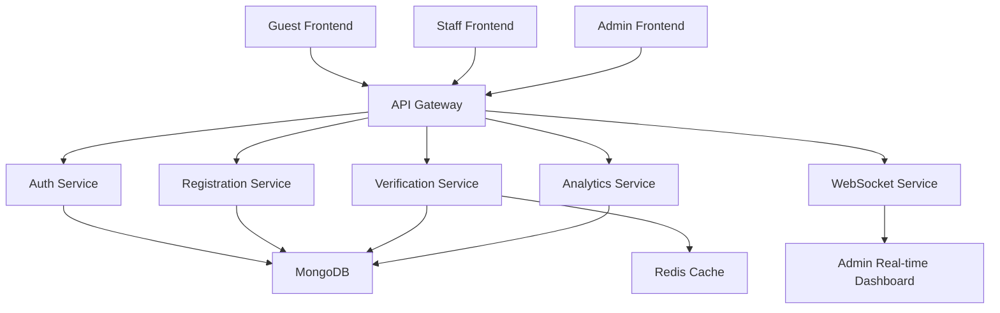

# Retirement Party Guest Management System

## Overview

I built this project to solve a real problem: managing large retirement celebrations is complex and messy. Event organizers juggle guest RSVPs, staff assignments, meal preferences, check-in workflows, and live attendance tracking—often using spreadsheets and fragmented tools that fail when things scale.

This is a full-stack event management platform with separate frontends for guests, staff, and administrators, a microservices backend with real-time updates, and role-based security. It demonstrates how to design a system that handles multiple user types, enforces permissions, and provides actionable data in real time.

---

## Problem Statement

Organizing a retirement event involves coordinating multiple stakeholders and workflows:

- **Guests** need to RSVP, select meal preferences, and add family members
- **Staff** need to verify guest identities quickly at check-in
- **Administrators** need visibility into attendance, meal counts, and event progress
- **Event organizers** need confidence that the system is secure, reliable, and fast

Without a digital system, these tasks create bottlenecks:

> How can organizers manage guest registrations, verify identities quickly, track attendance in real time, and maintain security without relying on manual spreadsheets or fragmented tools?

This project addresses that question with a modular, service-based platform built using modern web technologies and practical system-design principles.

---

## Project Goals

1. **Simplify guest registration** — Reduce RSVP friction and automate confirmation workflows
2. **Speed up check-in** — Enable staff to verify guests efficiently using confirmation codes or phone lookups
3. **Provide real-time visibility** — Give admins instant dashboards without manual data entry
4. **Enforce security** — Use role-based access control so staff and admins can't interfere with each other's workflows
5. **Build a maintainable codebase** — Separate responsibilities so each service can evolve independently

---

## Key Features

### Guest Experience
- Simple RSVP form with attendance confirmation
- Add family members and meal preferences
- Automatic confirmation code generation
- Secure, streamlined identity verification
- Mobile-friendly guest portal

### Staff Operations
- Staff login with role-based access
- Fast guest verification by confirmation code or phone number
- Event check-in workflow with immediate feedback
- Personal check-in history and reporting
- Protected access to verification APIs

### Admin Dashboard
- Real-time KPI summary (registrations, attendance, meals)
- Attendance and RSVP metrics
- Meal preference breakdown and trends
- Staff account management and activation
- Live check-in notifications without page refresh
- Analytics and reporting

### Authentication & Security
- Firebase-based email/password authentication
- Role-based access control (ADMIN, STAFF roles)
- Secure token verification at API gateway and service level
- Deactivation of staff access without affecting registered data
- Password strength requirements (8+ chars, mixed case, number, special char)
- CORS and Helmet security middleware

### Real-Time Updates
- Live admin dashboard that updates when guests check in
- Socket.IO-based notifications for instant awareness
- Server-Timing headers for performance monitoring
- Event-driven architecture with fire-and-forget patterns

---

## System Architecture



### Architecture Rationale

I separated the system into distinct services for several reasons:

- **Single Responsibility Principle** — Each service owns its domain (auth, registration, verification, analytics)
- **Independent Scaling** — If check-in load spikes, I can scale the Verification Service without touching Analytics
- **Parallel Development** — Frontend and backend teams can work independently
- **Easier Testing** — Services can be tested in isolation with clear contracts
- **Resilience** — If one service slows down, others continue operating

For example, the WebSocket Service uses a "fire-and-forget" pattern: when a guest checks in, the Verification Service doesn't wait for the admin dashboard to receive the notification. If the notification service is temporarily down, check-in still succeeds.

---

## Service Breakdown

| Service | Purpose | Responsibility |
|---------|---------|-----------------|
| **API Gateway** (Port 4000) | Central entry point | Firebase token verification, request routing, rate limiting, security headers |
| **Auth Service** (Port 5000) | Identity bridge | User registration, role enforcement, staff account management, session control |
| **Registration Service** (Port 5001) | Guest enrollment | RSVP processing, confirmation code generation, family member and meal tracking |
| **Verification Service** (Port 5002) | High-performance check-in | Guest verification by code or phone, check-in recording, Redis caching for fast lookups |
| **Analytics Service** (Port 5003) | Dashboard metrics | Aggregated reporting, attendance trends, meal analysis, staff performance |
| **WebSocket Service** (Port 4001) | Real-time notifications | Admin dashboard live updates, event broadcasting, authenticated connections |
| **Admin Frontend** (Port 3000) | Event management | Dashboard, staff management, analytics views, real-time updates |
| **Staff Frontend** (Port 3001) | Check-in operations | Guest verification, quick check-in workflow, history tracking |
| **Guest Frontend** (Port 3002) | RSVP portal | Registration form, confirmation display, meal selection |

---

## Technology Stack

### Frontend Technologies

| Technology | Why I Used It |
|-----------|---------------|
| **Next.js** | Framework for building React applications with server-side rendering and structured file-based routing. Used to scaffold all three frontends with shared patterns. |
| **React** | Component-based UI library for building interactive user interfaces. Provides reusable, stateful components for forms, dashboards, and real-time updates. |
| **TypeScript** | Static type checking for JavaScript. Catches common errors during development and makes refactoring safer. Used in all frontend code. |
| **Tailwind CSS** | Utility-first CSS framework for styling. Enables rapid UI development with consistent spacing, colors, and responsive design. |
| **Redux Toolkit** | State management library for predictable app state. Used in admin and staff frontends to manage authenticated user information, roles, and shared application state across components. Includes built-in middleware for handling non-serializable data (like Firebase user objects). |
| **Socket.IO Client** | Real-time bidirectional communication. Used in the admin frontend to receive live check-in notifications from the WebSocket Service without polling. |
| **Recharts** | React charting library. Used in the admin dashboard to visualize attendance, meal preferences, and check-in trends. |
| **react-hook-form** | Form state management for React. Used for efficient form handling without managing form state in component state. |
| **Zod** (Frontend) | Runtime type validation. Used to validate API responses and form inputs on the client side. |

### Backend Technologies

| Technology | Why I Used It |
|-----------|---------------|
| **Node.js** | JavaScript runtime for building server-side applications. Chosen for async I/O performance and shared language across frontend and backend. |
| **Express.js** | Minimal, flexible web framework for building APIs and microservices. Used to create REST endpoints in all backend services with middleware support. |
| **MongoDB** | NoSQL database for storing guests, staff, check-in records, and analytics data. Chosen for schema flexibility and native support for hierarchical data (e.g., family members as subdocuments). |
| **Firebase Admin SDK** | Authentication and identity management backend. Bridges between Firebase user credentials (email/password) and application-level roles stored in MongoDB. Handles secure token verification. |
| **Zod** | Runtime input validation for backend. Ensures all API inputs match expected schemas before reaching business logic. Provides type-safe error messages. |
| **Redis** (Upstash) | In-memory caching layer. Used in Verification Service for fast guest lookups during check-in. Includes single-flight coalescing to prevent cache stampede when multiple check-in requests arrive simultaneously. |

### APIs & Communication

| Technology | Why I Used It |
|-----------|---------------|
| **REST API** | Standard HTTP-based architecture for service-to-service and client-to-server communication. Clear request/response contracts. |
| **API Gateway Pattern** | Central request router that verifies Firebase tokens early, reducing duplicate authentication logic in individual services. Implements rate limiting and CORS. |
| **Socket.IO & WebSocket** | Real-time bidirectional communication for live admin dashboard updates. Replaces polling with push-based event delivery. |

### Security

| Technology | Why I Used It |
|-----------|---------------|
| **Firebase Token Verification** | Validates that requests include valid Firebase ID tokens. Used at the API Gateway and individual services for defense-in-depth authentication. |
| **JWT/Token-Based Authentication** | Stateless authentication where tokens carry user identity and permissions. Enables scaling without shared session state. |
| **Role-Based Access Control (RBAC)** | Fine-grained permission system (ADMIN, STAFF roles) to ensure users can only access features appropriate to their role. Enforced at middleware level. |
| **CORS** | Controls which origins can access the API. Prevents unauthorized cross-origin requests. |
| **Helmet** | Security middleware that sets HTTP headers (CSP, X-Frame-Options, etc.) to prevent common attacks. |

### Testing

| Technology | Why I Used It |
|-----------|---------------|
| **Jest** | JavaScript testing framework. Used to test API routes, validation schemas, middleware, and business logic in backend services. Includes mocking, coverage reporting, and performance benchmarking. |

### Infrastructure

| Technology | Why I Used It |
|-----------|---------------|
| **Docker** | Containerization for consistent deployment across environments. Each service includes a Dockerfile for building and running in production. |
| **Environment Variables (.env)** | Configuration management without hardcoding secrets. Separates environment-specific settings (database URLs, API keys) from code. |

---

## Why I Chose These Technologies

When I started this project, I wanted to build something realistic but also practical for learning. Here's how I decided:

**Frontend**: Next.js + React felt natural because it's production-grade but also has great documentation. TypeScript was a must—I wanted type safety to prevent silly errors. Redux Toolkit was useful for the admin and staff portals because they needed to persist authentication state and share user information across many components. The guest portal stayed simple (no Redux) because guests complete a form and leave—no complex state needed.

**Backend**: Express.js is lightweight and gives me full control without too much magic. MongoDB was a good fit because I didn't need strict schemas upfront; I could evolve the data model as I learned what data I needed. Firebase handled authentication so I didn't have to build password hashing and session management from scratch.

**Redis & Socket.IO**: I realized that during a live event, dozens of staff might try to check in guests simultaneously. Redis caching with smart single-flight request coalescing prevents the database from getting hammered. Socket.IO for real-time admin updates meant admins see check-ins instantly instead of refreshing manually.

**Zod for Validation**: Early on, I had validation scattered all over. Zod centralized it at the entry point so I knew invalid data never reached business logic.

---

## Repository Structure

```text
Retirement Party Guest ManagementSystem/
├── README.md
├── retirement-party-api-gateway/           # Central request router (Port 4000)
├── retirement-party-auth-service/          # Identity & role management (Port 5000)
├── retirement-party-registration-service/  # Guest RSVP (Port 5001)
├── retirement-party-verification-service/  # Fast check-in with caching (Port 5002)
├── retirement-party-analytics-service/     # Dashboard metrics (Port 5003)
├── retirement-party-websocket-service/     # Real-time notifications (Port 4001)
├── retirement-party-frontend-admin/        # Admin dashboard (Port 3000)
├── retirement-party-frontend-staff/        # Staff check-in (Port 3001)
└── retirement-party-frontend-guest/        # Guest RSVP form (Port 3002)
```

Each folder is independent with its own `package.json`, configuration, and tests. This makes it easy to develop, test, and deploy services separately.

---

## Application Workflow

### Typical Guest Journey
1. Guest opens guest portal and fills RSVP form (name, email, phone, meal preference, family members)
2. System generates a unique confirmation code
3. Confirmation code and phone number stored in MongoDB
4. On event day, staff looks up guest by code or phone
5. System verifies guest exists and hasn't checked in yet
6. Staff confirms check-in
7. Admin dashboard updates in real time via Socket.IO
8. Guest marked as checked in

### Admin & Staff Setup
1. Admin registers via Firebase authentication
2. Auth Service creates admin profile in MongoDB
3. Admin can create staff accounts with strong password requirements
4. Staff can log in and immediately start verifying guests
5. Admin sees real-time analytics and staff performance

### Real-Time Updates
- When a guest checks in, Verification Service broadcasts event to WebSocket Service
- WebSocket Service publishes to admin-dashboard room
- Admin frontend receives Socket.IO event and updates dashboard without page refresh

---

## Design Approach

### Separation of Responsibilities

I organized the system so each service has a clear, focused job:

- **Auth Service** handles only user identity and roles
- **Registration Service** handles only guest RSVP data
- **Verification Service** handles only check-in logic (and caches results)
- **Analytics Service** handles only read-only reporting (never writes to database)
- **WebSocket Service** handles only real-time notifications (never touches guest data)

This made it much easier to understand, test, and modify each part independently.

### API Gateway Pattern

Instead of having frontends talk directly to microservices, all requests go through an API Gateway. The gateway:

1. Verifies Firebase tokens early (fails fast)
2. Adds correlation IDs for debugging
3. Applies rate limiting
4. Routes to the correct service
5. Adds security headers

This prevents each service from reimplementing authentication and security logic.

### Cache-Aside Strategy with Single-Flight Coalescing

During a live event, many staff might try to check in the same guest simultaneously. If I naively cache lookups, a cache miss could cause a "thundering herd" where 20 requests hit MongoDB at once.

I solved this using **single-flight request coalescing**: when multiple requests ask for the same cached key simultaneously, they all wait for a single database query, then share the result. This dramatically reduces load during spikes.

### Fire-and-Forget Events

The WebSocket Service is used for nice-to-have real-time updates, not critical operations. So I designed it as fire-and-forget: when a check-in succeeds, the Verification Service doesn't wait for the notification to be delivered. If the WebSocket Service is temporarily down, check-in still works—the admin just won't see the update immediately.

---

## Efficient Data Handling

Building this system taught me to think carefully about how data flows:

### Guest Lookup Optimization

When staff verifies a guest, speed matters. The system handles this efficiently:

- **Phone normalization**: Strip formatting, store as digits only for consistent lookups
- **Redis caching**: Store recent guest lookups with 60-second TTL
- **Confirmation number**: Partial unique index allows nulls (non-attending guests don't get confirmation numbers)
- **Composite indexes**: Index on (attending + registeredAt) for dashboard queries

When staff looks up a guest by phone or code, the system checks Redis first. On cache miss, it queries MongoDB once and caches the result. Multiple concurrent lookups for the same guest all wait for that single query.

### Analytics Aggregation

Dashboard queries aggregate thousands of records. Instead of fetching all guests and filtering in code, MongoDB's aggregation pipeline:

- Filters in the database layer
- Aggregates (counts, groupings) before sending to the API
- Caches the final summary in Redis for 15 seconds

This reduces network traffic and API response time.

### Avoiding Repeated Processing

I use database features to prevent wasted work:

- **Atomic check-in**: `findOneAndUpdate` ensures we can't double-check a guest
- **Explicit cache invalidation**: After check-in, delete from Redis immediately so the next lookup gets fresh data
- **Partial indexes**: Only store confirmation numbers for attending guests, keeping the index small

---

## What I Learned

Building this system gave me practical experience with:

- **Full-stack architecture**: Designing multiple frontends and a microservices backend that work together
- **State management**: Using Redux Toolkit to manage persistent authentication state in complex frontends
- **Real-time communication**: Implementing Socket.IO for push-based updates instead of polling
- **Database design**: Designing MongoDB schemas with proper indexes, partial indexes, and subdocuments for hierarchical data
- **Caching strategy**: Understanding cache invalidation, single-flight coalescing, and when to cache
- **API design**: Building REST endpoints with clear contracts, validation, and error handling
- **Security**: Implementing authentication (Firebase), authorization (RBAC), and defense-in-depth patterns (dual-gate verification)
- **Testing**: Writing Jest tests for routes, validation, middleware, and critical business logic
- **Modular architecture**: Keeping services loosely coupled so they can evolve independently

While building verification and analytics features, I focused on efficient lookup, validation, and data processing—using database features like indexes and aggregation pipelines rather than processing data in application code.

---

## Business Value

This system solves real operational challenges:

- **Reduces manual workload** — Event organizers spend less time managing spreadsheets and data entry
- **Minimizes check-in delays** — Staff can verify and check in guests in seconds using code or phone lookup
- **Improves accuracy** — Centralized database eliminates duplicate or inconsistent records
- **Provides real-time insight** — Admins see attendance and trends as they happen, not after manual reconciliation
- **Increases security** — Role-based access control prevents staff from accessing admin features and vice versa
- **Builds confidence** — Event teams trust the system is reliable, secure, and fast enough for a live event

---

## User Roles

### Admin
- Registers via email and password
- Creates and manages staff accounts
- Views comprehensive dashboards (attendance, meals, trends)
- Activates or deactivates staff access
- Reviews real-time check-in updates
- Can verify guests manually if needed

### Staff
- Logs in with admin-provided credentials
- Verifies guests by confirmation code or phone number
- Records check-ins at the event
- Views their own check-in history and statistics
- Cannot access admin features or other staff data

### Guest
- Completes RSVP form with personal and family information
- Selects meal preferences
- Receives confirmation code
- Provides confirmation code or phone at check-in
- Cannot access admin or staff features

---

## Deployment Status

The system is architecturally ready for production deployment:

- **Dockerfiles** prepared for all backend services
- **Environment configuration** patterns in place (`.env` files, config management)
- **Security hardened** with token verification, RBAC, and middleware
- **Tested** with Jest covering critical routes, validation, and logic
- **Monitoring-ready** with Server-Timing headers and performance metrics

The next deployment steps would include:

- Container image build and registry setup
- Cloud infrastructure provisioning (compute, managed MongoDB, Redis)
- Domain and SSL certificate configuration
- CI/CD pipeline for automated testing and deployment
- Production secret management (API keys, Firebase credentials)
- Load balancer or reverse proxy setup for traffic routing
- Database backup and recovery procedures

The project demonstrates deployment-ready practices but hasn't been deployed to production yet.

---

## Testing

I used **Jest** to test important application logic across backend services:

### Test Coverage by Service

- **Auth Service**: User creation, role validation, password strength, middleware
- **Registration Service**: RSVP processing, confirmation code generation, family member handling
- **Verification Service**: Guest lookup, check-in atomicity, cache behavior, performance benchmarks
- **Analytics Service**: Aggregation queries, trend calculation, cache invalidation
- **API Gateway**: Request routing, token verification, rate limiting
- All services: Error handlers, input validation with Zod, middleware chains

### Running Tests

```bash
# Run all tests in a service
cd retirement-party-verification-service
npm test

# Watch mode (auto-rerun on file changes)
npm run test:watch

# Coverage report
npm run test:coverage

# Performance benchmarks
npm run benchmark
```

Tests ensure that critical operations (authentication, check-in, lookup) work correctly and that invalid inputs are rejected safely.

---

## Future Enhancements

Future versions could add:

- **Email automation** — Send RSVP reminders and confirmation emails
- **QR code check-in** — Generate QR codes on confirmation, scan at event
- **Multi-event support** — Manage multiple retirement events in one system
- **Advanced reporting** — Export attendance and meal data to CSV/PDF
- **Audit logs** — Track who checked in guests, staff activity, admin changes
- **Mobile app** — Native iOS/Android for guests and staff
- **Survey integration** — Post-event feedback collection
- **Accessibility improvements** — WCAG compliance for larger audiences

---

## License

This project is distributed under the ISC License.

---

## Related Project Documentation

For implementation details, refer to service-specific READMEs:

- [API Gateway](retirement-party-api-gateway/README.md)
- [Auth Service](retirement-party-auth-service/README.md)
- [Registration Service](retirement-party-registration-service/README.md)
- [Verification Service](retirement-party-verification-service/README.md)
- [Analytics Service](retirement-party-analytics-service/README.md)
- [WebSocket Service](retirement-party-websocket-service/README.md)
- [Admin Frontend](retirement-party-frontend-admin/README.md)
- [Staff Frontend](retirement-party-frontend-staff/README.md)
- [Guest Frontend](retirement-party-frontend-guest/README.md)
