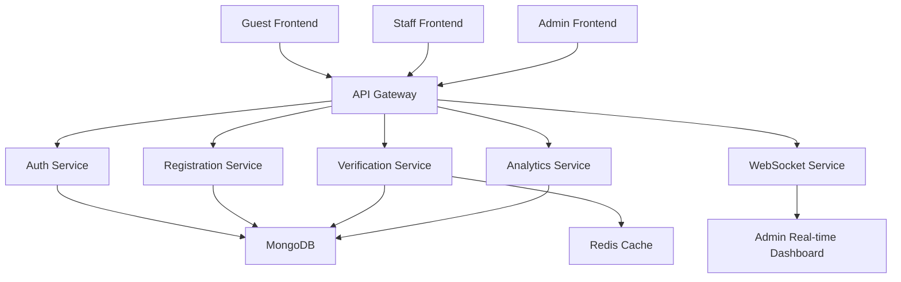

# Retirement Party Guest Management System

A modern, secure, and scalable event-management platform designed for retirement celebrations, guest registrations, staff check-ins, and real-time dashboard reporting.

This project solves the operational pain of manually managing guest attendance, meal preferences, staff access, and event analytics by bringing everything into a microservice-based system with role-based authentication, live dashboards, and fast verification workflows.

---

## Overview

Retirement events involve many moving parts: inviting guests, confirming attendance, tracking meal preferences, managing family members, assigning staff for check-in, and reporting event performance in real time. Traditional spreadsheet-based workflows are slow, error-prone, and difficult to manage at scale.

This system replaces fragmented processes with a centralized digital workflow for:

- Guest RSVP and attendance registration
- Confirmation and verification using phone number or code
- Staff check-in and validation
- Admin analytics and reporting
- Secure role-based access for administrators and staff
- Real-time updates during events

---

## Why This Project Exists

The real-world problem addressed by this project is the lack of a reliable, secure, and efficient way to manage a large retirement event with multiple participants and stakeholders.

Without a proper system, event managers often face:

- Duplicate or inconsistent guest records
- Missed confirmations and poor RSVP tracking
- Confusion around meal preferences and family attendance
- Manual check-in delays at the venue
- Poor visibility into attendance numbers and trends
- Security risk when staff and admin access are not controlled properly
- No live data for decision-making during the event

This project was created to centralize and automate these workflows while keeping operations secure, fast, and transparent.

---

## Problem Statement

Large social and corporate events require coordinated management across multiple stakeholders.

The project addresses a classic event-management problem:

> How can organizers register guests, verify identities quickly, manage staff access, monitor attendance in real time, and maintain the integrity of information without relying on manual spreadsheets, fragmented tools, or insecure processes?

The answer is a full digital platform built around a microservices architecture, modern authentication, and event-specific workflows.

---

## Core Objectives

The system is built to achieve the following goals:

1. Simplify guest registration and RSVP tracking
2. Make event attendance verification fast and reliable
3. Improve staff productivity at the check-in desk
4. Prevent unauthorized access with identity-based security
5. Give event admins instant visibility into attendance and analytics
6. Support scalable growth across future events and departments

---

## Key Features

### Guest Experience
- Guest RSVP form with attendance status
- Family and attendee information collection
- Meal preference tracking
- Confirmation flow for event attendance
- Secure, streamlined guest identity verification

### Staff Operations
- Staff login and role-based access
- Verification by confirmation code or phone number
- Event check-in workflow
- Check-in history and staff-level reporting
- Protected access to verification APIs

### Admin Capabilities
- Admin dashboard with KPI summaries
- Attendance and RSVP metrics
- Meal preferences and trend analysis
- Staff account management
- Live dashboard updates via real-time notifications

### Security
- Firebase authentication integration
- Role-based access control (ADMIN, STAFF)
- MongoDB-backed user record verification
- Token-based API verification
- Protected internal service communication

### Real-Time Event Intelligence
- Live updates when guests check in or register
- Dashboard updates without requiring full page refresh
- WebSocket-based notifications for admin users

---

## System Architecture



The platform follows a microservice design so each component can focus on a specific responsibility:

- Authentication and role enforcement
- Guest registration and RSVP management
- Verification and check-in processing
- Analytics and reporting
- Real-time admin notifications

---

## Service Breakdown

| Service | Purpose | Port |
|---|---|---|
| retirement-party-api-gateway | Central API entry point, routing, authentication, security | 4000 |
| retirement-party-auth-service | User identity, Firebase auth bridge, admin/staff role management | 5000 |
| retirement-party-registration-service | Guest registration and RSVP processing | 5001 |
| retirement-party-verification-service | Guest verification and check-in logic | 5002 |
| retirement-party-analytics-service | Charts, summaries, and read-only dashboard metrics | 5003 |
| retirement-party-websocket-service | Real-time admin notifications | 4001 |
| retirement-party-frontend-admin | Admin portal and dashboard | 3000 |
| retirement-party-frontend-staff | Staff check-in portal | 3001 |
| retirement-party-frontend-guest | Guest registration and confirmation portal | 3002 |

---

## Technology Stack

### Frontend
- Next.js
- React
- TypeScript
- Tailwind CSS
- Socket.IO Client
- Recharts

### Backend
- Node.js
- Express.js
- MongoDB
- Firebase Admin SDK
- Zod validation
- Redis (for selected service caching)

### Infrastructure & Security
- Docker support
- Environment-based configuration
- JWT/Firebase token verification
- Role-based authorization
- CORS and Helmet security middleware

---

## Repository Structure

```text
Retirement Party Guest ManagementSystem/
├── README.md
├── retirement-party-api-gateway/
├── retirement-party-auth-service/
├── retirement-party-registration-service/
├── retirement-party-verification-service/
├── retirement-party-analytics-service/
├── retirement-party-websocket-service/
├── retirement-party-frontend-admin/
├── retirement-party-frontend-staff/
├── retirement-party-frontend-guest/
└── ...
```

Each folder is an independent module designed for a specific business function, allowing the system to evolve without tightly coupling every feature into a single application.

---

## Business Value Delivered

This project creates business value in several ways:

- Reduces manual event administration workload
- Minimizes check-in bottlenecks on event day
- Improves guest experience with easier RSVP and confirmation
- Improves operational accuracy with centralized data
- Gives organizers real-time visibility into event performance
- Increases trust by enforcing secure access rules
- Creates a scalable foundation for future event platforms

---

## Typical User Roles

### Admin
- Manages staff accounts
- Reviews dashboard analytics
- Oversees attendance metrics and event status
- Handles user activation and access control

### Staff
- Verifies guests by confirmation code or phone number
- Records event check-ins
- Reviews personal check-in history

### Guest
- Registers attendance
- Adds family details and meal choices
- Confirms or updates attendance status

---

## Workflow Example

A typical guest journey looks like this:

1. A guest opens the guest portal
2. The guest submits RSVP details and meal preferences
3. Registration data is saved in the system
4. Staff or admin can verify the guest using confirmation code or phone lookup
5. The guest is checked in on event day
6. Admin dashboard updates in real time
7. Organizer can review attendance and meal analytics instantly

---

## Local Development Setup

### Prerequisites

- Node.js 20+
- npm
- Git
- MongoDB Atlas or local MongoDB instance
- Firebase project with authentication enabled
- Optional Redis service for cache-enabled services

### Clone the repository

```bash
git clone <repository-url>
cd "Retirement Party Guest ManagementSystem"
```

### Install dependencies

Each service includes its own package.json and can be installed independently.

```bash
cd retirement-party-api-gateway && npm install
cd ../retirement-party-auth-service && npm install
cd ../retirement-party-registration-service && npm install
cd ../retirement-party-verification-service && npm install
cd ../retirement-party-analytics-service && npm install
cd ../retirement-party-websocket-service && npm install
cd ../retirement-party-frontend-admin && npm install
cd ../retirement-party-frontend-staff && npm install
cd ../retirement-party-frontend-guest && npm install
```

### Run the services

Use separate terminal sessions for each service.

```bash
# API Gateway
cd retirement-party-api-gateway
npm run dev

# Auth Service
cd ../retirement-party-auth-service
npm run dev

# Registration Service
cd ../retirement-party-registration-service
npm run dev

# Verification Service
cd ../retirement-party-verification-service
npm run dev

# Analytics Service
cd ../retirement-party-analytics-service
npm run dev

# WebSocket Service
cd ../retirement-party-websocket-service
npm run dev

# Frontends
cd ../retirement-party-frontend-admin && npm run dev
cd ../retirement-party-frontend-staff && npm run dev
cd ../retirement-party-frontend-guest && npm run dev
```

---

## Environment Variables

Each service expects its own environment configuration. The project uses `.env` files and Firebase credentials for secure local development.

Common variables include:

- `PORT`
- `NODE_ENV`
- `MONGO_URI`
- `DB_NAME`
- `FIREBASE_PROJECT_ID`
- `FIREBASE_CLIENT_EMAIL`
- `FIREBASE_PRIVATE_KEY`
- `CORS_ORIGINS`
- `AUTH_SERVICE_URL`

Important note:

> Firebase service account files and local environment secrets are not intended to be committed to the public repository. Keep credentials in secure local environment files or deployment secrets management.

---

## Testing

Most services include Jest test coverage for routes, validation, middleware, and business logic.

Example commands:

```bash
cd retirement-party-api-gateway && npm test
cd retirement-party-auth-service && npm test
cd retirement-party-registration-service && npm test
cd retirement-party-verification-service && npm test
cd retirement-party-analytics-service && npm test
cd retirement-party-websocket-service && npm test
```

---

## Deployment Status

This project is functionally complete and prepared for deployment, but the actual production deployment step is still pending and will be completed soon.

The repository already contains:

- Dockerfiles for backend services
- Frontend app structure for hosted deployment
- Environment-based configuration patterns
- Microservice-ready architecture
- Security and authentication integration

The next deployment tasks typically include:

- environment configuration for cloud hosting
- Docker image build and registry setup
- reverse proxy or load balancer configuration
- domain and SSL setup
- secret management for production credentials
- CI/CD pipeline setup

---

## Future Enhancements

This project is a strong foundation for future event management features such as:

- guest invitation email automation
- QR code-based check-in
- admin event scheduling and calendar support
- multi-event management
- advanced reporting and exports
- audit logs and user activity history
- mobile-first attendee experience

---

## Project Impact

This application directly improves the way retirement events are organized by turning a traditionally manual and error-prone process into a digital experience that is:

- faster
- more secure
- more transparent
- easier to scale
- easier to manage by event teams

---

## License

This project is distributed under the ISC License.

---

## Final Note

The Retirement Party Guest Management System is more than a demo or simple event app. It is a practical, real-world solution for managing guest interactions at a major celebration with secure user roles, live operations, and analytics-driven decision-making.

It demonstrates how modern software architecture can solve a genuine operational problem in the service industry and event management domain while preparing the foundation for production deployment and future growth.

---

## Related Project Documentation

For service-specific implementation details, refer to the service READMEs in their respective folders:

- retirement-party-api-gateway
- retirement-party-auth-service
- retirement-party-registration-service
- retirement-party-verification-service
- retirement-party-analytics-service
- retirement-party-websocket-service
- retirement-party-frontend-admin
- retirement-party-frontend-staff
- retirement-party-frontend-guest
