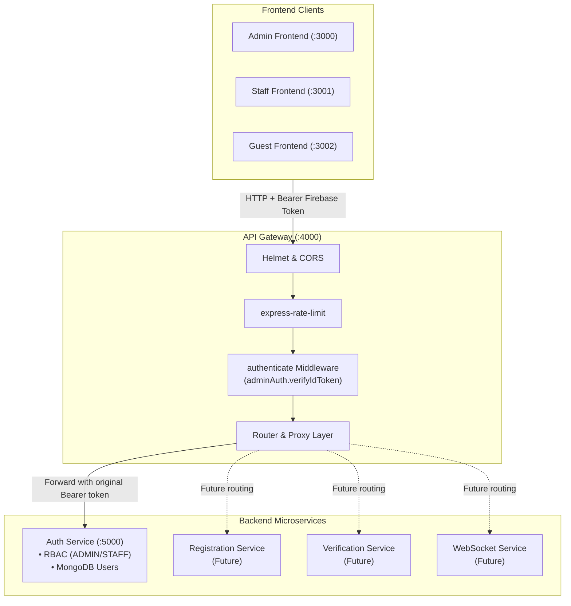

# Retirement Party API Gateway (`retirement-party-api-gateway`)

The **API Gateway** is the single public backend entry point for the **Retirement Party Guest Management System** microservices architecture. It provides reverse proxy routing, Firebase ID token authentication, rate limiting, CORS management, and security enforcement for all client applications (Guest, Staff, and Admin frontends).

---

## 1. Architectural Overview



### Separation of Responsibilities

| Responsibility | API Gateway (:4000) | Auth Service (:5000) | Firebase Auth | MongoDB Atlas |
|---|---|---|---|---|
| **Public API Entry Point** | ✅ Yes | ❌ Internal only | ❌ Cloud auth | ❌ Persistent DB |
| **Verify Firebase ID Token** | ✅ Gateway Gate | ✅ Inner Gate | ❌ Issuer | ❌ |
| **Manage Application Roles** | ❌ None | ✅ Source of truth (`ADMIN`/`STAFF`) | ❌ | ❌ |
| **Manage User Status** | ❌ None | ✅ `isActive` flag verification | ❌ | ❌ |
| **Store Persistent Data** | ❌ Stateless | ❌ Passes to DB | ❌ | ✅ `users` collection |
| **Issue Custom JWTs** | ❌ Strictly forbidden | ❌ Strictly forbidden | ✅ Firebase ID tokens | ❌ |

---

## 2. Directory Structure

```
retirement-party-api-gateway/
├── src/
│   ├── config/
│   │   ├── env.js              # Environment variables & startup validation
│   │   └── firebase.js         # Firebase Admin SDK singleton initialization
│   ├── middleware/
│   │   ├── authenticate.js     # Firebase ID token verification & req.auth attachment
│   │   ├── rate-limit.js       # General and authentication rate-limiters
│   │   └── error-handler.js    # Centralized error mapping (400, 401, 404, 502, 500)
│   ├── routes/
│   │   ├── health.routes.js    # /health (Gateway) and /health/auth (Downstream)
│   │   └── auth.routes.js      # Proxies /auth/* and /api/auth/* to Auth Service
│   ├── services/
│   │   └── auth-client.js      # HTTP proxy client for Auth Service
│   ├── utils/
│   │   └── proxy-request.js    # Generic HTTP request forwarder & safe logger
│   ├── app.js                  # Express application setup
│   └── server.js               # Server startup & graceful shutdown
├── tests/
│   ├── authenticate.test.js    # 4 unit tests for auth middleware
│   ├── health.test.js          # 3 unit tests for health endpoints
│   └── auth.routes.test.js     # 6 unit tests for auth routing & error mapping
├── .env.example
├── .gitignore
├── .dockerignore
├── Dockerfile
├── package.json
└── README.md
```

---

## 3. Environment Configuration

Copy `.env.example` to `.env`:

```bash
cp .env.example .env
```

| Variable | Default | Description |
|---|---|---|
| `PORT` | `4000` | Gateway listening port |
| `NODE_ENV` | `development` | Node environment (`development` / `production`) |
| `AUTH_SERVICE_URL` | `http://localhost:5000` | Internal URL of the Auth Service |
| `CORS_ORIGINS` | `http://localhost:3000,http://localhost:3001,http://localhost:3002` | Allowed frontend origins |
| `FIREBASE_PROJECT_ID` | `""` | Firebase project ID (optional if using `ServiceAccountKey.json`) |
| `FIREBASE_CLIENT_EMAIL`| `""` | Firebase service account client email |
| `FIREBASE_PRIVATE_KEY` | `""` | Firebase service account private key |

### Firebase Credentials Options

1. **Local Development (File-based)**:
   Place `ServiceAccountKey.json` directly in `retirement-party-api-gateway/` root.
2. **Production / Docker (Env-var-based)**:
   Set `FIREBASE_PROJECT_ID`, `FIREBASE_CLIENT_EMAIL`, and `FIREBASE_PRIVATE_KEY` in environment variables.

---

## 4. API Routes

### Health Check Routes

| Method | Endpoint | Auth Required | Description |
|---|---|---|---|
| `GET` | `/health` | No | Checks Gateway status (returns 200) |
| `GET` | `/health/auth` | No | Proxies health check to Auth Service (returns downstream status or 503) |

### Authentication & Staff Management Routes (Proxied to Auth Service)

All routes require `Authorization: Bearer <Firebase ID Token>`.

| Method | Gateway Endpoint | Target Auth Service Endpoint | Description |
|---|---|---|---|
| `GET` | `/auth/me` | `GET /api/auth/me` | Fetch authenticated user profile |
| `POST` | `/auth/sync` | `POST /api/auth/sync` | Update user `lastLoginAt` |
| `POST` | `/auth/admin/register` | `POST /api/auth/admin/register` | Register Admin MongoDB profile |
| `POST` | `/auth/staff` | `POST /api/auth/staff` | Create new Staff member (Admin only) |
| `GET` | `/auth/staff` | `GET /api/auth/staff` | List all Staff members (Admin only) |
| `GET` | `/auth/staff/:uid` | `GET /api/auth/staff/:uid` | Get Staff details (Admin only) |
| `PATCH` | `/auth/staff/:uid/status` | `PATCH /api/auth/staff/:uid/status` | Activate/deactivate Staff (Admin only) |
| `POST` | `/auth/staff/:uid/revoke` | `POST /api/auth/staff/:uid/revoke` | Revoke Staff sessions (Admin only) |

*(Note: Gateway also accepts `/api/auth/*` aliases for maximum frontend compatibility).*

---

## 5. Security & Safety

- **Zero Credential Logging**: Request logging explicitly skips `Authorization` headers, passwords, and tokens.
- **Helmet Security Headers**: Enables `X-Content-Type-Options`, `Strict-Transport-Security`, `X-Frame-Options`, etc.
- **Request Body Limits**: JSON and URL-encoded body parsing is capped at `100kb`.
- **CORS Protection**: Blocks unauthorized cross-origin requests, dynamically allowing configured frontends.
- **Graceful Error Sanitization**: Masks internal Firebase, Node.js, and network errors. Returns `502 Bad Gateway` if downstream Auth Service is unreachable.

---

## 6. Running Locally

### Prerequisites
1. Node.js 20+
2. Auth Service running on port `5000`

### Commands
```bash
# 1. Install dependencies
npm install

# 2. Run automated test suite
npm test

# 3. Start development server (with nodemon)
npm run dev

# 4. Start production server
npm start
```

---

## 7. Running with Docker

```bash
# Build the Docker image
docker build -t retirement-party-api-gateway .

# Run the container
docker run -p 4000:4000 \
  -e AUTH_SERVICE_URL=http://host.docker.internal:5000 \
  -e CORS_ORIGINS=http://localhost:3000,http://localhost:3001 \
  retirement-party-api-gateway
```

